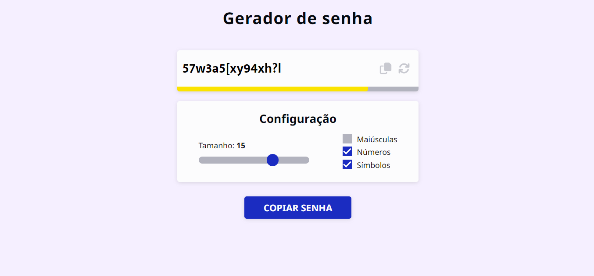

# Gerador de Senhas 
Este é um gerador de senhas simples feito com HTML, CSS e JavaScript. Ele permite que você gere senhas aleatórias com base nas configurações definidas.



# Principai Funcionalidades
- Geração de senhas aleatórias com base nas configurações selecionadas.
- Configuração do tamanho da senha.
- Inclusão de letras maiúsculas, números e símbolos na senha.
- Barra de indicação de segurança da senha.

# Tecnologias Utilizadas
- HTML
- CSS
- JavaScript

# Estrutura do Código
O código do gerador de senhas é dividido em três partes principais: a estrutura HTML, o estilo CSS e a lógica JavaScript.

### Estrutura HTML
A estrutura HTML define a organização e os elementos visuais do gerador de senhas. Ela é composta pelos seguintes elementos principais:

- header: Cabeçalho contendo o título do gerador de senhas.
- main: Área principal que contém as seções do gerador.
- section.container: Contêiner para exibir a senha gerada e a barra de indicação de segurança.
- section.config: Seção de configuração para personalizar os critérios de geração da senha.
- div.btn: Botão para copiar a senha gerada.

### Estilo CSS
O estilo CSS é responsável por definir a aparência e o layout do gerador de senhas. Ele utiliza classes e seletores para estilizar os elementos HTML. Alguns estilos importantes são:

- Definição de cores e fontes utilizando variáveis CSS.
- Responsividade do layout através de media queries.
- Estilização dos elementos de entrada de texto, botão e a barra de indicação de segurança.


### Lógica JavaScript
A lógica JavaScript é responsável por gerar as senhas, atualizar a barra de indicação de segurança e lidar com as interações do usuário. Algumas funções principais incluem:

- generatePassword: Gera uma senha com base nos critérios selecionados pelo usuário.
- security: Atualiza a barra de indicação de segurança com base no tamanho da senha e nos critérios selecionados.
- copy: Copia a senha gerada para a área de transferência.
- Event listeners para capturar as interações do usuário, como alterar o tamanho da senha, selecionar critérios ou clicar no botão de copiar.

# Utilização
Para utilizar esse gerador de senhas na sua máquina siga os seguintes passos:
- Clone o repositório para sua máquina local utilizando o seguinte comando:
```bash
  git clone https://github.com/ViniciusQuintas/Gerador-de-Senhas.git
```
- Após clonar o repositório, navegue até o diretório Gerador-de-Senhas no terminal:
```bash
  cd Gerador-de-Senhas
```
1. Abra o arquivo **index.html** em um navegador da web.
2. Defina as configurações desejadas para a senha:
- Tamanho da senha: Arraste o controle deslizante para selecionar o tamanho da senha desejado.
- Maiúsculas: Marque a caixa se deseja incluir letras maiúsculas na senha.
- Números: Marque a caixa se deseja incluir números na senha.
- Símbolos: Marque a caixa se deseja incluir símbolos na senha.
3. A senha será gerada automaticamente com base nas configurações selecionadas e exibida na caixa de texto.
4. Para copiar a senha gerada, você pode clicar no botão "Copiar senha" ou no ícone de cópia ao lado da caixa de texto.
5. Uma mensagem de confirmação será exibida quando a senha for copiada com sucesso.

Teste diferentes configurações para gerar senhas personalizadas e seguras.

# Contribuição
Se você deseja contribuir para o desenvolvimento desse gerador de senhas, siga os seguintes passos:

1️⃣ Faça um fork deste repositório. 
<br>
<br>
2️⃣ Crie uma nova branch para sua contribuição. 
<br>
<br>
3️⃣ Faça as alterações que desejar no código. 
<br>
<br>
4️⃣  Certifique-se de que suas alterações não vão quebrar o funcionamento já existente da aplicação. 
<br>
<br>
5️⃣ Faça um pull request com suas alterações. 
<br>
<br>

# Licença
Este projeto está licenciado sob a Licença MIT. Consulte o arquivo LICENSE para obter mais informações.
